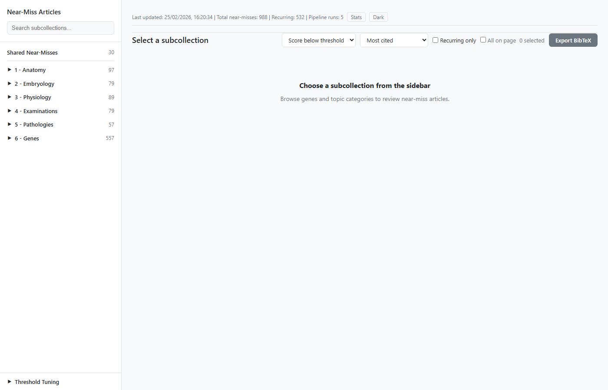
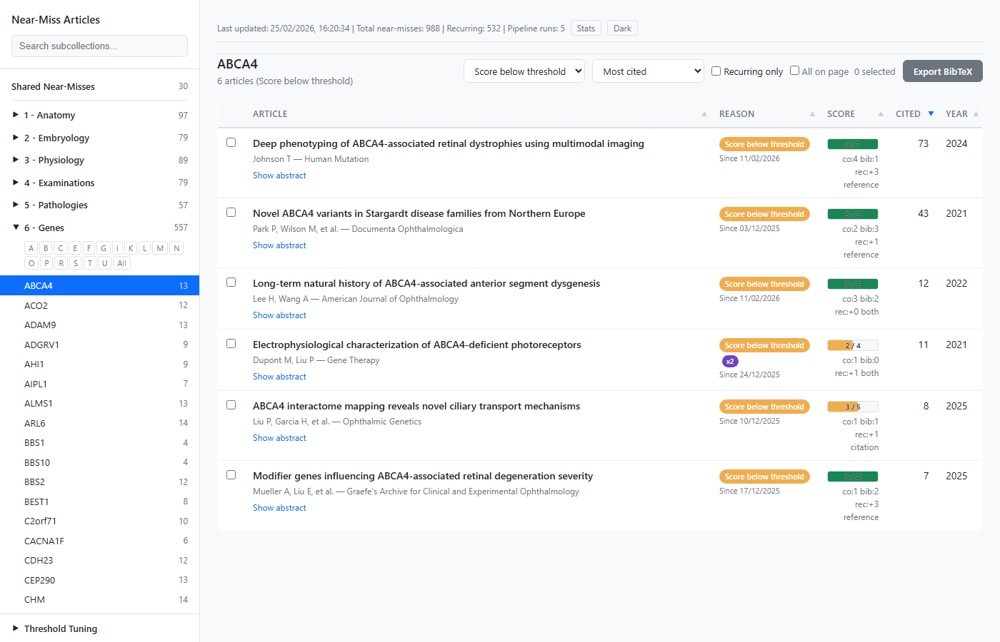
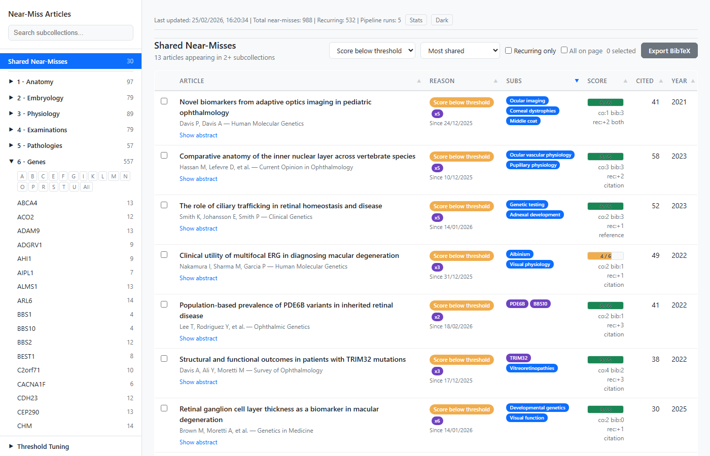
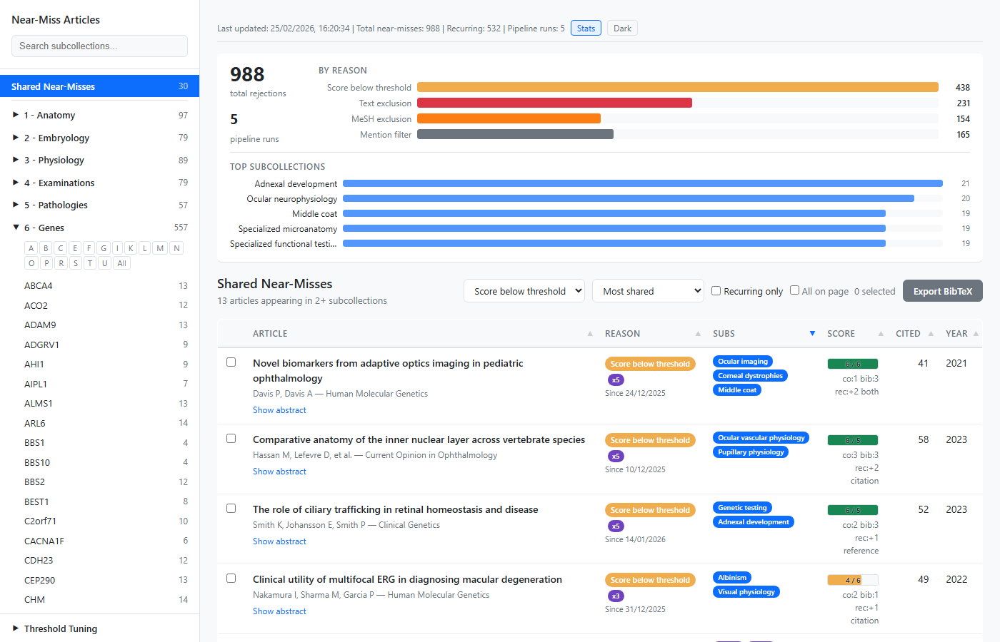
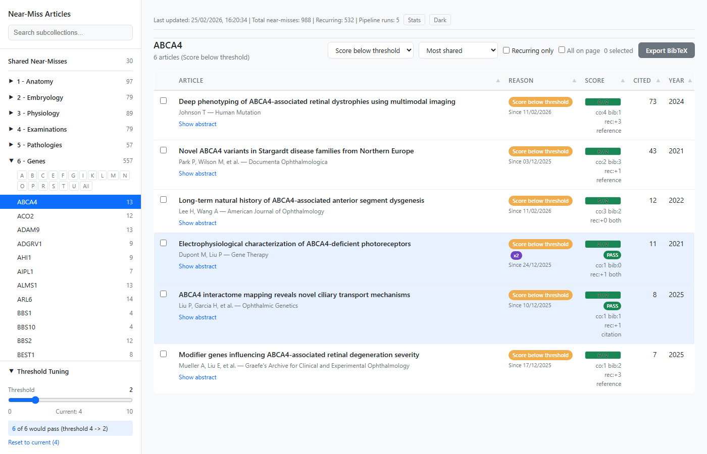
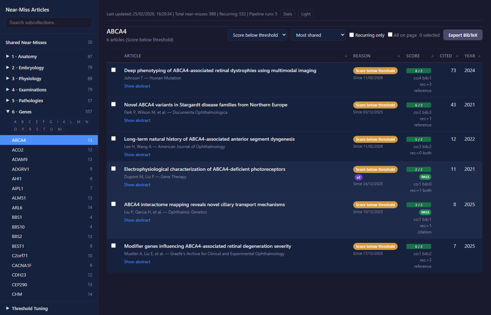

# Gene & Topic Literature Bot

OpenAlex-powered literature search with two complementary pipelines -- gene-specific papers (with citation network expansion) and topic-based ophthalmology literature (anatomy, embryology, physiology, examinations, pathologies). Automatic upload to a Zotero group library. Runs on GitHub Actions (no server needed).

## How it works

### Gene pipeline

For each gene, the pipeline runs three passes:

#### Pass 1 -- Search (bootstrap only)

Skipped if the gene already has papers in Zotero (uses existing collection as seeds instead).

When the collection is empty, searches OpenAlex using a boolean query:

```
(GENE OR alias1 OR alias2) AND ("disease A" OR "disease B" OR ...)
```

- Gene terms come from HGNC aliases
- Disease terms come from the `tags` field in `genes.yml` (slug `retinitis-pigmentosa` -> `"retinitis pigmentosa"`)
- Filtered to `type:article, has_pmid:true`
- Capped at `search.max_results` results (default 25)
- Papers passing text exclusion are uploaded with `source:search` tag

#### Pass 2 -- Citation network expansion

Expands from the seed set (existing Zotero papers, or search results) via two hops:

**Hop 1**: For each seed, collect backward references and forward citations. Score every candidate:

```
effective_score = co_citations + bib_coupling_bonus + recency_bonus

  co_citations        -- how many seeds reference or cite this candidate
  bib_coupling_bonus  -- min(shared_references_with_seed_set, 3)
  recency_bonus       -- max(0, 3 - (current_year - paper_year))
```

Candidates must clear an adaptive threshold:

```
adaptive_min_co = min(max_min_co, max(min_co_citations, floor(log2(library_size))))
```

| library_size | adaptive_min_co (with defaults: min=1, max=6) |
|---|---|
| 1-3          | 1 |
| 4-7          | 2 |
| 8-15         | 3 |
| 16-31        | 4 |
| 32-63        | 5 |
| 64+          | 6 (capped) |

After filtering, full metadata is fetched for surviving candidates. A mention-term filter then removes any paper that does not mention the gene symbol or an alias in its title or abstract.

**Hop 2**: Top `hop2_top_n` (default 10) candidates from hop 1 become new seeds; the same scoring and filtering logic repeats.

Surviving candidates are text-filtered, deduplicated, and uploaded with `source:citation` tag.

#### Pass 3 -- Recent papers

A separate OpenAlex search filtered to the current year:

```
(GENE OR aliases) AND (disease terms) AND from_publication_date:YYYY-01-01
```

Capped at `search.recent_max_results` (default 10). Bypasses the adaptive citation threshold entirely -- new papers cannot yet accumulate co-citations or bibliographic coupling, so they are fetched directly. Text-filtered, deduplicated, uploaded with `source:recent` tag.

### Topic pipeline

For each sub-topic defined in `topics.yml`, the pipeline searches OpenAlex using one of two modes:

#### Keyword OR mode (categories 1-4: Anatomy, Embryology, Physiology, Examinations)

All keywords are OR'd into a single query, scoped to the ophthalmology subfield and optional topic IDs:

```
title_and_abstract.search: "corneal anatomy" OR "sclera structure" OR ...
primary_topic.subfield.id: 2731
type: review|article
```

#### Disease+clinical AND mode (category 5: Pathologies)

For each disease keyword, AND with clinical keywords, then merge results across diseases:

```
title_and_abstract.search: "retinitis pigmentosa" AND ("phenotype" OR "genotype" OR ...)
primary_topic.subfield.id: 2731
```

Per-disease result cap = `max_results / len(diseases)` (floor of 5).

#### Shared steps

After search:
1. Apply text exclusion and MeSH exclusion filters
2. Deduplicate against shared PMID set (cross-pipeline)
3. Upload with `source:search` tag, tagged with category and sub-topic names
4. Citation expansion (if enabled) with mention-term filtering
5. Recent papers pass for current-year publications
6. Link related items via Zotero dc:relation

Collections are created as nested hierarchies mirroring the vault structure (e.g., "1 - Anatomy" / "Tunique externe").

---

## Setup

### 1. Get API credentials

| Credential | Where |
|---|---|
| **Zotero API key** | https://www.zotero.org/settings/keys/new -- enable Read/Write on your group |
| **Zotero group ID** | Numeric ID from your group URL: `zotero.org/groups/123456/...` |
| **OpenAlex API key** | Optional. https://openalex.org -- higher rate limit |

### 2. Configure GitHub repository

1. Fork or push this repo to GitHub
2. Go to **Settings > Secrets and variables > Actions**
3. Add these secrets:
   - `ZOTERO_API_KEY`
   - `ZOTERO_GROUP_ID`
   - `OPENALEX_API_KEY` (optional, recommended)

### 3. Edit config files

#### `genes.yml` -- gene pipeline

Add your genes of interest. Each gene can have disease keyword tags and optional custom text exclusion terms.

```yaml
search:
  max_results: 25          # cap search results per gene (bootstrap only)
  recent_max_results: 10   # cap recent-papers pass per gene

citation_expansion:
  max_seed_papers: 100     # top N most-cited seeds used for expansion
  min_co_citations: 1      # floor for adaptive threshold
  max_min_co: 6            # ceiling for adaptive threshold
  max_hops: 2
  hop2_top_n: 10

genes:
  - symbol: ABCA4
    collection: ABCA4
    tags:
      - stargardt-disease
      - retinitis-pigmentosa
    exclude_text:           # optional per-gene override (inherits defaults otherwise)
      - "some term"
```

#### `topics.yml` -- topic pipeline

Define categories and sub-topics with keywords. Settings inherit: sub-topic > category > global.

```yaml
search:
  max_results: 30
  recent_max_results: 10

openalex_scoping:
  subfield_id: 2731        # ophthalmology
  type_filter: "review|article"

categories:
  - name: "1 - Anatomy"
    sub_topics:
      - name: "Tunique externe"
        collection: "Tunique externe"
        keywords:
          - "corneal anatomy"
          - "sclera structure"

  - name: "5 - Pathologies"
    sub_topics:
      - name: "Dystrophies retiniennes"
        collection: "Dystrophies retiniennes"
        clinical_keywords:
          - "phenotype"
          - "genotype"
        diseases:
          - name: "Retinitis pigmentosa"
            en_keywords:
              - "retinitis pigmentosa"
              - "rod-cone dystrophy"
```

### 4. Run

- **Automatic**: runs every Sunday at 03:00 UTC (edit cron in `.github/workflows/genebot.yml`)
- **Manual**: go to Actions tab > Gene & Topic Literature Bot > Run workflow
  - `mode`: empty (both pipelines), `genes`, or `topics`
  - `genes`: space-separated gene symbols (e.g., `CRB1 PAX6`)
  - `categories`: topic category filter (e.g., `1 - Anatomy`)

## Local usage

```bash
pip install -r requirements.txt

export ZOTERO_API_KEY="xxx"
export ZOTERO_GROUP_ID="123456"

python run.py                          # both pipelines (default)
python run.py --genes                  # all genes from genes.yml
python run.py --genes CRB1 RHO        # specific genes only
python run.py --topics                 # all topic categories
python run.py --topics anatomy         # specific category (alias)
python run.py --topics "1 - Anatomy"   # specific category (full name)
```

### Category aliases

| Alias | Resolves to |
|-------|-------------|
| `anatomy` | `1 - Anatomy` |
| `embryology` | `2 - Embryology` |
| `physiology` | `3 - Physiology` |
| `examinations` | `4 - Examinations` |
| `pathologies` | `5 - Pathologies` |

## Notes

- Idempotent: re-running only adds newly published papers (dedup by PMID)
- Cross-pipeline dedup: shared PMID set prevents the same paper appearing in both gene and topic collections
- Incremental: once a gene has papers in Zotero, search is skipped and existing papers seed the citation expansion
- Text exclusion (title + abstract, whole-word regex) removes off-topic papers (cancer, tumor, etc.)
- MeSH exclusion removes papers tagged with excluded MeSH descriptors (Neoplasms, Diabetes Mellitus, etc.)
- Provenance tagging: `source:search`, `source:citation`, `source:recent`
- Zotero uploads use batch API (50 items/request) with 60s timeout and 3-attempt retry
- Logs are uploaded as GitHub Actions artifacts (retained 30 days)

---

## Near-Miss Articles Dashboard

Every pipeline run generates a JSON log of articles that were considered but ultimately rejected. These near-misses are deployed as a static GitHub Pages dashboard so you can review what was filtered out and rescue interesting papers.













### What gets logged

| Rejection reason | When | Details captured |
|---|---|---|
| `score_below_threshold` | Citation expansion: candidate scored below adaptive threshold | co-citations, bib coupling, recency bonus, effective score, threshold, direction |
| `text_exclusion` | Title/abstract matched a blocked term (cancer, tumor, mouse model, ...) | matched term |
| `mesh_exclusion` | MeSH descriptors matched a blocked descriptor (Neoplasms, Diabetes, ...) | matched MeSH term |
| `mention_filter` | Citation candidate passed scoring but gene/keyword not mentioned in title or abstract | co-citations, bib coupling, recency bonus, effective score, direction |

For `score_below_threshold`, metadata is fetched for the top 50 candidates per hop (ranked by effective score) to keep API calls bounded.

### Dashboard features

- **Sidebar navigation**: collapsible tree following vault hierarchy (1-Anatomy through 6-Genes), with article counts per subcollection
- **Search**: real-time text filter on subcollection names; A-Z letter filter for genes
- **Reason filter**: dropdown to show all reasons or a specific one (defaults to score_below_threshold)
- **Sortable columns**: clickable headers (Article, Reason, Score, Cited, Year) with toggle asc/desc and visual sort arrows
- **Article table**: title (linked to PubMed), authors, journal, year, citation count, color-coded rejection badge, score breakdown for citation candidates
- **Score progress bars**: for score-below-threshold articles, a visual bar showing `effective_score / threshold` ratio with red (< 50%) / amber (50-80%) / green (> 80%) gradient
- **"Closest to threshold" sort**: preset that orders articles by how close they came to passing, auto-filtering to score-based rejections
- **Summary statistics panel**: collapsible stats bar (toggle via "Stats" button) showing total rejections, breakdown by reason as horizontal bars, and top 5 subcollections by article count
- **Cumulative tracking**: merges new rejections with existing data across runs; tracks `first_seen`, `last_seen`, and `seen_count` per article; recurring articles are flagged with a badge
- **Cross-subcollection view**: "Shared Near-Misses" entry in sidebar showing articles rejected in 2+ genes/topics, signaling broad relevance
- **Threshold tuning**: sidebar widget to adjust the adaptive threshold and preview which articles would have passed, with rescued articles highlighted in the table
- **Expandable abstracts**: click to toggle per article
- **Pagination**: 50 articles per page
- **BibTeX export**: select articles via checkboxes, export as `.bib` file for manual Zotero import
- **Dark mode**: defaults to system preference via `prefers-color-scheme`, with a manual toggle button in the header bar (persists via localStorage)

### How it deploys

After each pipeline run (including failures), the GitHub Actions workflow:

1. Copies `data/near_misses.json` into `site/data/`
2. Deploys the `site/` directory to the `gh-pages` branch via `peaceiris/actions-gh-pages@v4`

The dashboard is then accessible at `https://<username>.github.io/Zotero-automation/`.

**First-time setup**:
1. Go to **Settings > Actions > General > Workflow permissions** and enable **Read and write permissions**
2. Run the workflow once (manual trigger or wait for schedule)
3. Go to **Settings > Pages**, set Source to **Deploy from a branch**, Branch to **gh-pages** / **/ (root)**
4. The site URL will appear under Pages settings after a few minutes

### Local preview

Generate synthetic test data and serve locally:

```bash
python generate_test_data.py          # creates site/data/near_misses.json with ~880 articles
python -m http.server 8000 -d site    # open http://localhost:8000
```

### Files

| File | Purpose |
|---|---|
| `genebot/rejection_log.py` | `RejectionLog` class -- accumulates rejected articles during a pipeline run |
| `site/index.html` | Complete single-page dashboard (HTML + CSS + JS, no dependencies) |
| `generate_test_data.py` | Generates realistic synthetic near-misses for testing the dashboard |
| `data/near_misses.json` | Pipeline output (gitignored, generated at runtime) |
| `site/data/near_misses.json` | Copy for gh-pages deployment (gitignored, generated by CI) |
